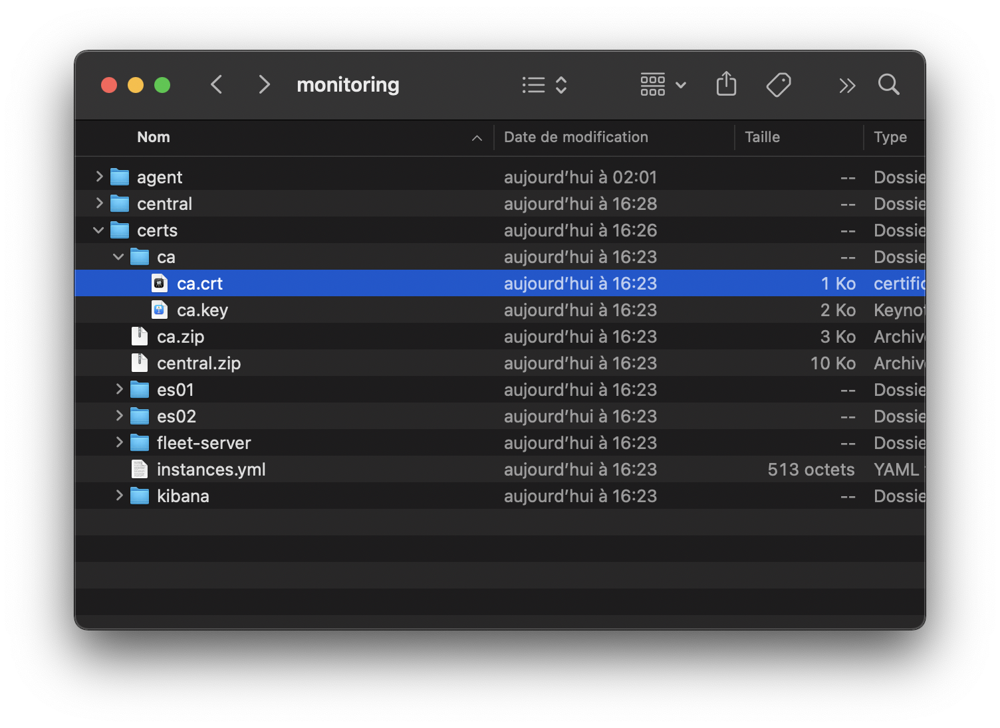
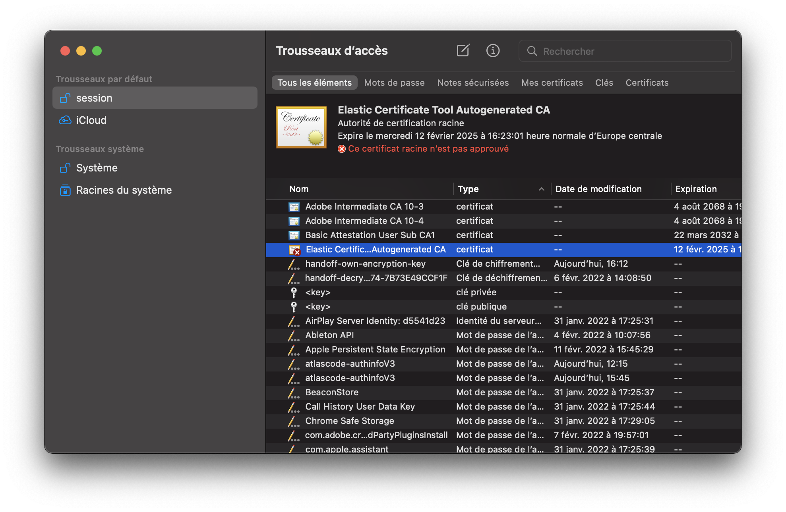
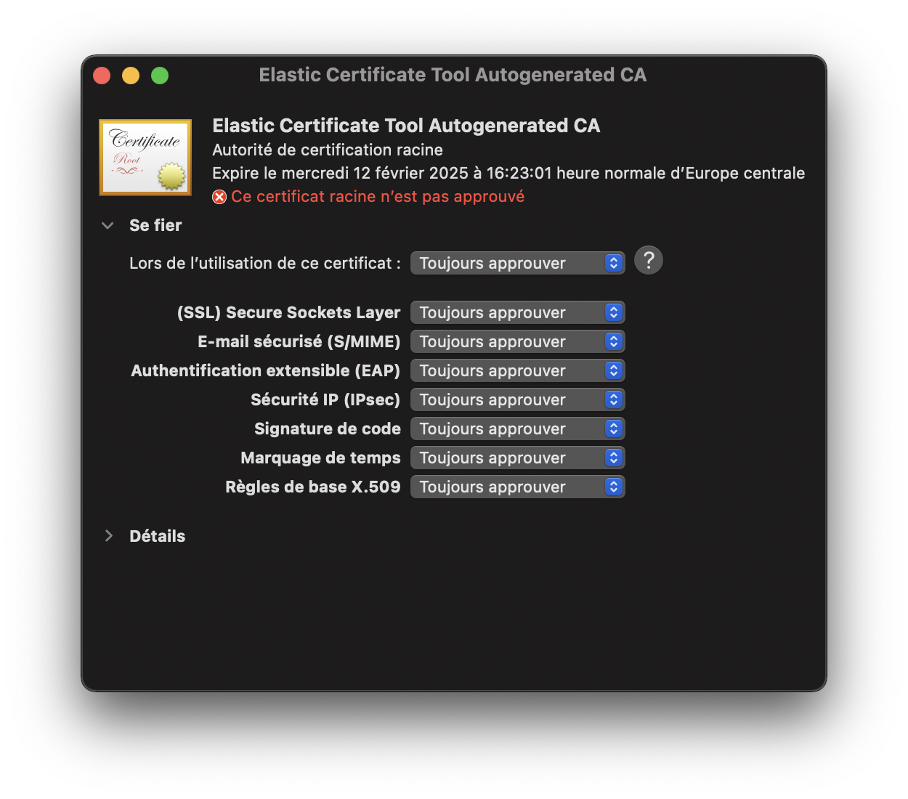
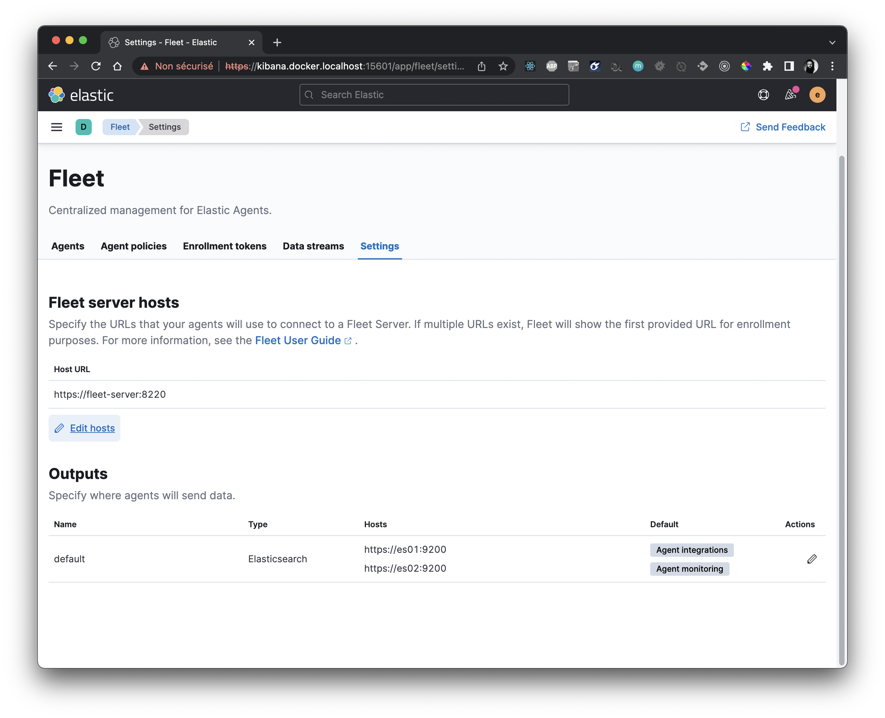
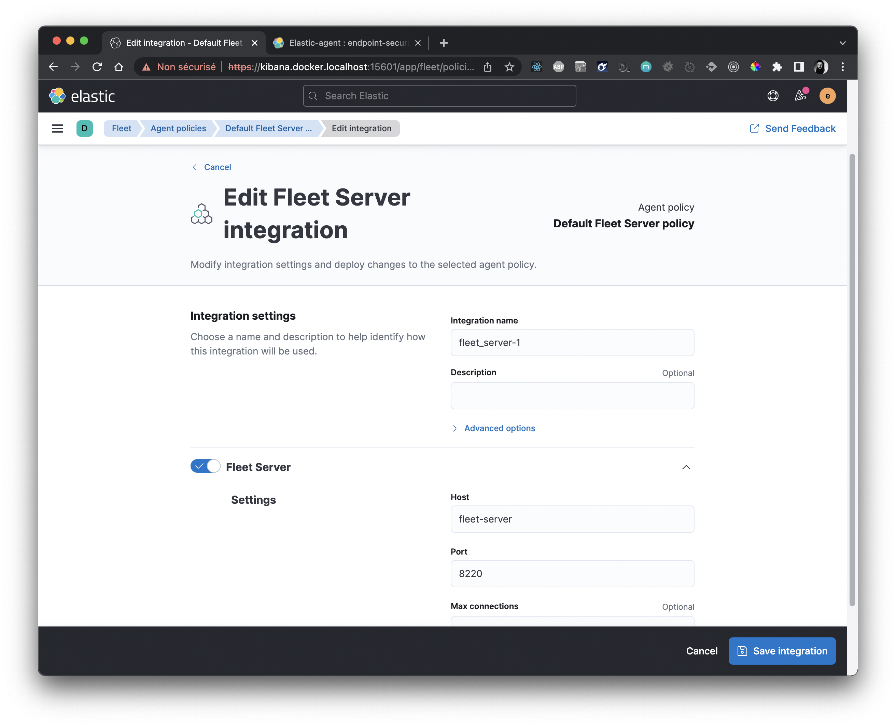
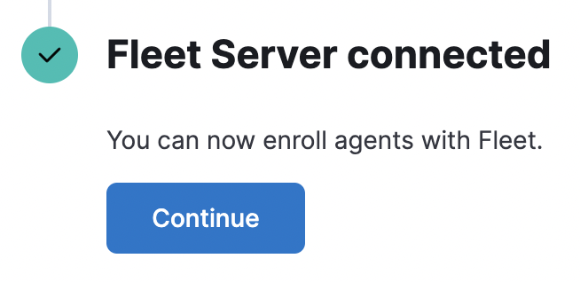
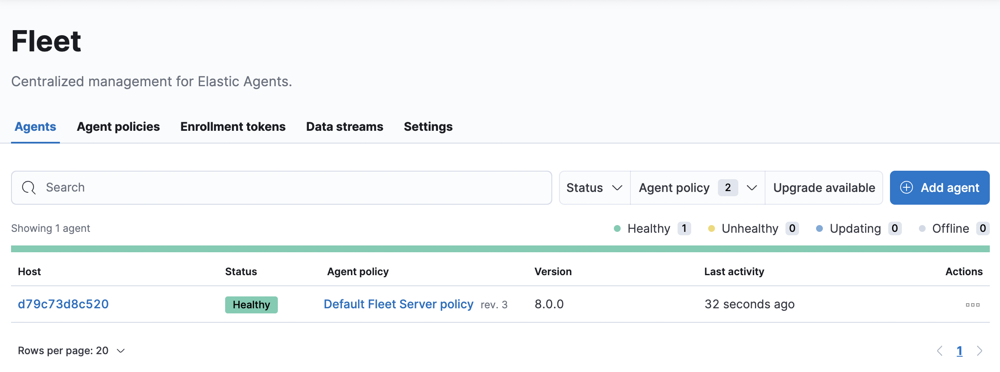

# MONITORING - CENTRAL


This project contains several services that form an [**elastic stack**](https://www.elastic.co/elastic-stack/), composed of `elasticsearch`, `kibana`, an `elastic-agent` that works as a [**fleet server**](https://www.elastic.co/guide/en/fleet/current/fleet-server.html). We will use that stach as a centralized source for the metrics we want to collect and display.

Furthermore, a setup service generates the requested certificates for https communication between those services, and set the `KIBANA_PASSWORD` for the `kibana_system` user in `elasticsearch`.

## Installation

### Clone project

```sh
git clone ...
```

### Set environment variables

Copy .env.sample to .env

```sh
cp .env.sample .env
```

### Create shared external volume and network

In order for all services to access the root certificate, create a shared volume :

```sh
docker volume create monitoring-certs --driver local
```

Create a network that will be accessible by services external to this central stack.

```sh
docker network create monitoring-network --driver bridge
```

### Start the elastic stack

First start the folowing services :

```sh
docker compose up setup es01 es02 kibana
```

### Use HTTPS locally

In order to access the kibana interface on your development machine, you will have to add the ca.crt root certificate into your keychain.

- Get the certicates from the containers:

```sh
docker compose cp kibana:/usr/share/kibana/config/certs ../
```

#### Mac OS X

Either do one off the following to add the root certicate :

- In Keychain Access, drag and drop the certificate monitoring/certs/ca.crt.
- Double click on the ca.crt file.



- You'll then need to approve the CA.





#### Linux

...

#### Windows

...

### Register a fleet server

Once started, you could connect on `https://kibana.docker.localhost:${KIBANA_PORT}`, using `elastic` as user and `${ELASTIC_PASSWORD}` variable as credentials.

Go to Fleet, add a *Fleet server policy*. From there, you could get a token. Replace the `FLEET_SERVER_SERVICE_TOKEN` and `FLEET_SERVER_POLICY` environment variables.


Then check that the settings are as in the following screen.



On the *Fleet Server Policy*, add the *Fleet Server integration* (if not already active):



You could start the Fleet Server :

```sh
docker compose up fleet-server
```

It should be ok :



And you should see the fleet server in the agent list:



## What next ?

Add Fleet agent where you need to, in order to get logs and metrics from the systems you need to monitor (see monitoring/agent project).

## Troubleshooting

> If you could not get any data from the Fleet Server (*Logs* tab on the agent page, or *Data-stream* tab on the Fleet page), and if there is a log on `es01` or `es02` complaining about a bad certificates, update in Fleet > Settings > Yaml :
>
> ```yaml
> ssl.verification_mode: none
> ```
